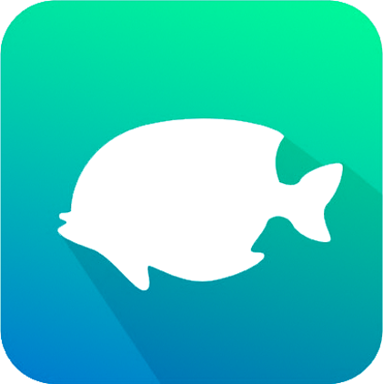
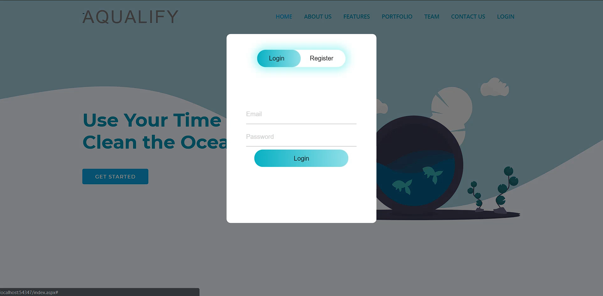
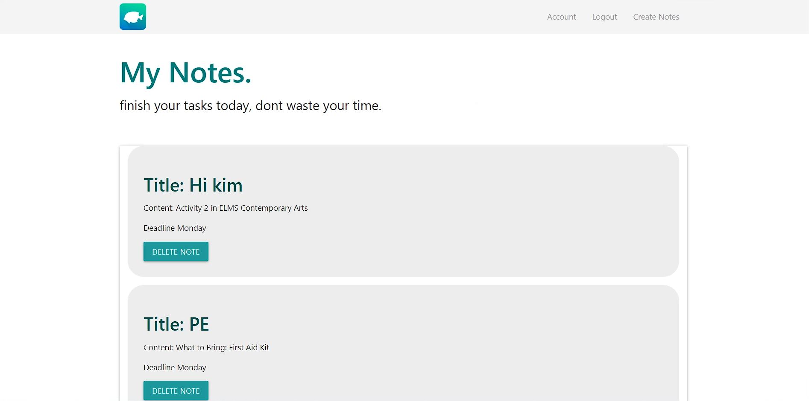
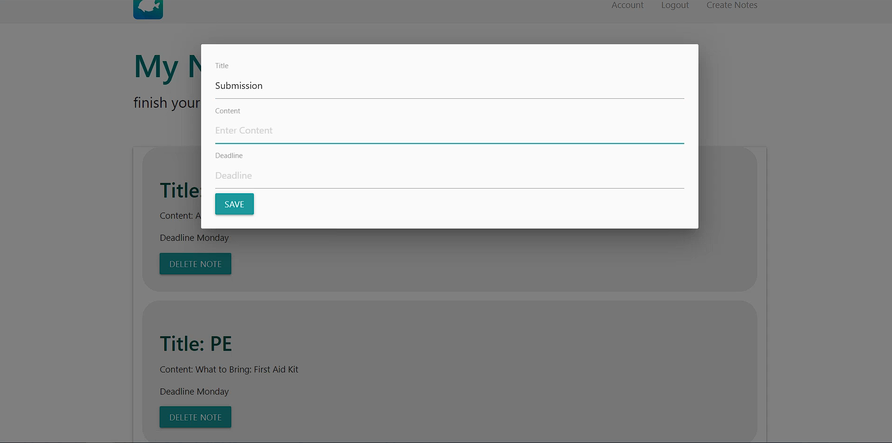

<!-- PROJECT LOGO -->
 

  

  <h3 align="center">Aqualify</h3>

  

    <h4 align="center">Aqualify Web App in C# with ASP.NET MVC</h4>
     
    <a href="https://youtu.be/f29NcSyUpY0">View Demo</a>
    ·
    <a href="https://github.com/Kim-Arcena/Aqualify-WebApp/issues">Report Bug</a>
    ·
    <a href="https://github.com/Kim-Arcena/Aqualify-WebApp/issues">Request Feature</a>
  

  <!-- ABOUT THE PROJECT -->
  <h2>About the Project</h2>

  
Aqualify, a multi-platform app. It is a productive and anti-procrastination app wherein it helps the users to change their gadget habits for the better and in a fun ingenious way. It’s a well-designed app that helps make the abstract idea of focusing away from your phone into a fun game It’s helpful for people who need extra help in order to sustain attention on their task and create a more balanced life. It features a Pomodoro focus timer - a personal preserve aquarium wherein the user must sustain a healthy marine environment. The condition of the marine preserve would correspond to the focus period of the user without using his/her device. The more focus the user, the healthier and cleaner the virtual marine biosphere.  .

  <h3>Overview:</h3>

  <ul>
    <li>Securely save user data in the cloud with Firebase Authentication (Firebase Database for the backend).</li>
    <li>Caters Firebase Admin/User Access level management</li>
    <li>Gives a general overview of the application including the features, developers, faqs, and testimonies.</li>
    <li>Create notes which will also appear on the Aqualify mobile app.</li>
    <li>Utilizes Bootstrap Framework for the Front-End</li>
    <li>CRUD application with Firebase Realtime Database (db also used in Aqualify Android App)</li>
  </ul>

  <!-- APP SCREENSHOT -->
  <h2>Gallery</h2>
  <h3>App Screenshots</h3>
  
  
  
  
   
  

  <!-- DEVELOPERS -->
  <h2>Developers</h2>
  <ul>
      <li>Senior Developer (Full Stack Web) - Kimberly Arceña</li>
      <li>Junior Developer (Back End Web) - <a href="https://github.com/Nikkolas-Cage">Nico Guarnes</a></li>
      <li>Software Tester</li>
      <ol>
        <li>Aldrin Esquierdo</li>
        <li>Mark Daniel Caingles</li>
        <li>Ervin Papa</li>
        <li>Andrea Maxine Gonzaga</li>
      </ol>
    </ul>

